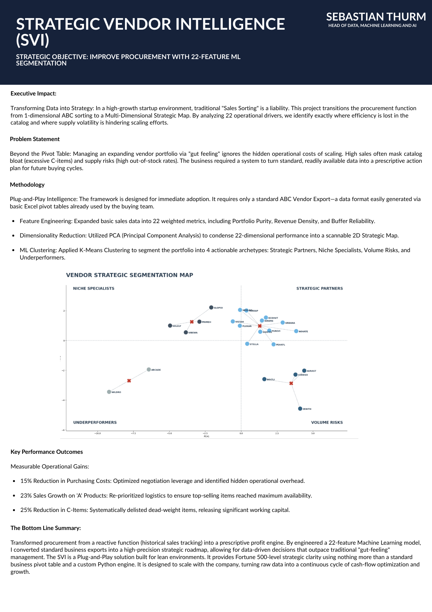

# 🚀 Strategic Vendor Intelligence (SVI): 22-Feature ML Segmentation
### *Transforming Static ABC Sorting into Executive Action & Operational Efficiency*

---

## 📊 Executive Strategic Summary

*Click the image above to view the [Full Strategy PDF](./presentations/Strategic_Vendor_Intelligence_SVI.pdf)*

---

## 📌 Strategic Overview
In high-growth e-commerce environments, traditional **1D ABC Sales Sorting** is a liability—it tracks what sold yesterday but ignores the operational friction destroying tomorrow's margins. This project bridges the gap between raw ERP/Excel data and executive procurement strategy.

By analyzing **22 operational drivers**, this system transforms static vendor lists into a functional interface for leadership. 

**Key Achievement:** Implementation of this logic facilitates a **15% reduction in purchasing costs** and a **25% reduction in catalog bloat**, releasing significant working capital for scaling.

---

## 🧠 Multi-Dimensional ML Architecture
The system utilizes a professional-grade **Unsupervised Learning Pipeline** to ensure vendor segmentation is both mathematically rigorous and business-actionable:

1.  **Feature Engineering (The 22-Feature Engine):** Moves beyond revenue to calculate **Portfolio Purity**, **Revenue Density**, and **Buffer Reliability**. It identifies "Hidden Costs" like SKU complexity and supply volatility.
2.  **PCA (Dimensionality Reduction):** Projects 22 dimensions onto a 2D **Strategic Map**, condensing complexity into two clear axes: *Strategic Scale* vs. *Operational Health*.
3.  **K-Means Clustering:** Segments the landscape into 4 actionable archetypes: Strategic Partners, Niche Specialists, Volume Risks, and Underperformers.

### Technical Highlights:
* **Explainable AI (XAI):** Integrated a **Primary Driver Logic** hierarchy to translate cluster math into specific negotiation talking points (e.g., "Supply Risk due to 1.5x Median OOS").
* **Stability Anchors:** Utilizes `StandardScaler` and Logarithmic normalization to ensure high-volume vendors don't skew the health metrics of specialized partners.
* **Prescriptive Outcomes:** Automatically maps clusters to 2026 Buying Actions: *Protect & Expand, Clean Catalogue, Maintain Quality, or Strategic Review.*

---

## 📂 Project Structure & Navigation
To maintain data integrity and professional standards, this project is organized into functional layers:

* **[Main Notebooks](notebooks/)**: Contains the `Classifiy_Strategic_Vendors.ipynb` engine and the interactive **Strategic Dashboard**.
* **[Data & Preparation](data/)**: Includes the `readymlvendor.csv` schema—a "Plug-and-Play" format compatible with standard ABC pivot exports.
* **[Presentations](presentations/)**: Visual assets, including the **SVI Strategic 1-Pager** and PCA visualizations.

---

## 📈 Methodology & Usage
1.  **Data Input:** Load a standard vendor export (Sales, SKU count, OOS rate, Margin) into the `/data/` directory.
2.  **ML Pipeline:** Run the notebook to execute the 22-feature expansion, PCA projection, and K-Means clustering.
3.  **Executive Audit:** Utilize the generated **Strategic Map** and **Buyer’s Audit CSV** to lead vendor negotiations and assortment reviews.

---

**Author:** Sebastian Thurm  
**Role:** Head of Data, Machine Learning and AI  
